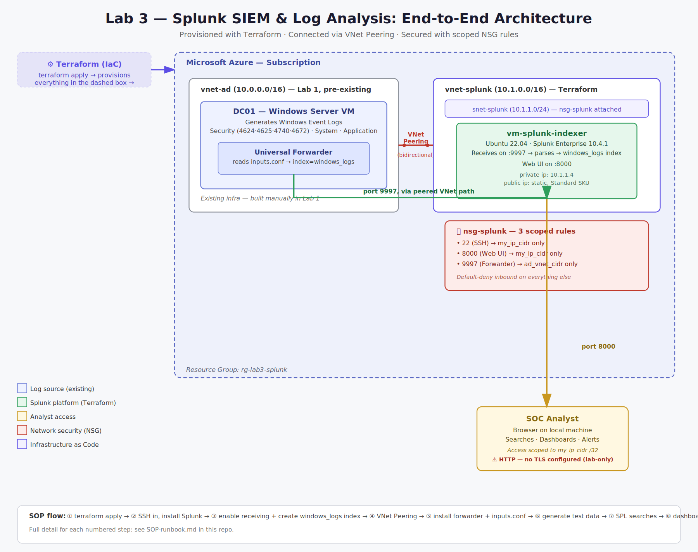

# 🛡️ Lab 3 — Splunk SIEM & Log Analysis

**Stack:** Splunk Free (Enterprise trial → free tier) · Azure VM (Ubuntu 22.04) · Terraform (IaC) · Windows Server VM (from Lab 1) · SOC Skills

| | |
|---|---|
| 🎓 **Certification alignment** | CompTIA Security+ · CySA+ · Splunk Core Certified User |
| 💰 **Cost** | $0 — Splunk Free license covers this entire lab (500MB/day indexing) |
| ⏱️ **Time to complete** | 4–6 hours across multiple sessions |
| 💼 **Career relevance** | SOC Analyst (Tier 1–3) · Security Engineer · Incident Responder · Cloud/DevOps Engineer (IaC) |

---

## 🎯 The Business Problem This Lab Solves

A medium-sized organization generates millions of log events every day — Windows Event Logs from workstations, authentication logs from Active Directory, firewall logs from network equipment, web server access logs, cloud resource logs. Without a SIEM, those logs sit in separate systems and nobody can search across them, correlate events, or spot patterns that indicate an attack.

The SIEM is the security operations center's primary tool. When an alert fires, the SOC analyst opens the SIEM and searches the logs to understand **what happened, when, from where, and what was affected**. When a security team wants to know whether a particular threat has touched their environment, they search the SIEM.

Splunk is the most widely deployed commercial SIEM. Building this lab gives you a concrete, demonstrable skill that shows up on job descriptions for nearly every security operations role — and provisioning it with Terraform instead of point-and-click demonstrates the Infrastructure-as-Code discipline that separates a SOC analyst from a Cloud/Security Engineer.

| Role | How this lab applies |
|---|---|
| 🔍 SOC Analyst Tier 1 | Monitoring dashboards for alerts, searching logs for suspicious activity, escalating findings |
| 🕵️ SOC Analyst Tier 2–3 | Building detection rules, correlating events across data sources, threat hunting |
| ☁️ Cloud Security Engineer | Microsoft Sentinel and AWS Security Hub use the same SIEM concepts; Terraform-provisioned infra is the same IaC discipline used to stand up production security tooling |
| 🚨 Incident Responder | Searching logs during an active incident, building a timeline of events, identifying scope of compromise |

---

## 🏗️ Architecture

Windows Server VM (Lab 1) → Universal Forwarder → Splunk Indexer (Terraform-provisioned Ubuntu VM) → Splunk Web UI → SOC Analyst

```
DC01 (Windows Server VM, Lab 1)
  Generates Windows Event Logs — Security (4624/4625/4740), System, Application
  Universal Forwarder installed here
        │  port 9997, encrypted
        ▼
Splunk Indexer (Ubuntu 22.04) — PROVISIONED VIA TERRAFORM
  Receives logs on port 9997, parses & indexes into windows_logs index
        │  parsed and stored
        ▼
Splunk Web UI — Search and Reporting (http://VM-IP:8000)
  SPL searches · Dashboards · Alerts
        │  HTTPS, port 8000
        ▼
SOC Analyst (browser on local machine)
  Searches · dashboards · alert investigation

NSG rules (defined in terraform/main.tf):
  🔐 Port 22 (SSH)         → your IP only
  🔐 Port 8000 (Web UI)    → your IP only
  🔐 Port 9997 (forwarder) → Lab 1 AD VNet CIDR only, via VNet Peering
```


---

## ⚙️ Infrastructure as Code

The Splunk VM, its VNet/subnet, NSG, public IP, and NIC are **provisioned entirely with Terraform** — not the Azure Portal. Config lives in [`terraform/`](terraform/):

| File | Purpose |
|---|---|
| `versions.tf` | Pins Terraform + `azurerm` provider versions |
| `variables.tf` | All configurable inputs (IPs, sizing, naming) — no hardcoded values in resources |
| `main.tf` | Resource group, VNet, subnet, NSG (3 scoped rules), static public IP, NIC, Ubuntu VM |
| `outputs.tf` | Public/private IP, ready-to-use SSH command, Splunk web UI URL |
| `terraform.tfvars` | Your real values — gitignored, never committed |

Full run instructions: [`terraform/README.md`](terraform/README.md). Deploying is `terraform init` → `plan` → `apply`; tearing down for the day is `terraform destroy`, and `apply` again next session reproduces an identical environment in minutes.

**[SCREENSHOT PLACEHOLDER: `terraform apply` output showing the created resources and outputs]**

---

## 📚 Key Concepts (Read Before Starting)

- 🧩 **SIEM** — Security Information and Event Management. Collects logs from across the environment into one searchable place. Two core jobs: **correlation** (connecting events across systems) and **alerting** (notifying analysts automatically).
- 🔎 **SPL (Search Processing Language)** — Splunk's query language. Works as a pipeline: `index=windows_logs EventCode=4624 | stats count by Account_Name | sort -count`. Find the events, then shape the results.
- 🗂️ **Index** — A named storage bucket for events, like a database table. This lab uses one index: `windows_logs`.
- 📡 **Universal Forwarder** — A lightweight, free agent installed on any machine whose logs you want in Splunk. Monitors log files/Windows Event Logs, compresses and forwards them to your indexer over port 9997.
- 🏗️ **Infrastructure as Code (Terraform)** — Declarative config describing the desired end state of infrastructure; a state file tracks what Terraform believes exists, so re-running `apply` reconciles reality to match the code rather than re-creating things from scratch.
- 📝 **inputs.conf** — Config file on the forwarder that defines which logs get collected and which index they land in. See [`scripts/inputs.conf`](scripts/inputs.conf).

---

## ✅ What This Build Demonstrates

| Skill | Real-world application |
|---|---|
| 🏗️ Provision cloud infrastructure with Terraform | Reproducible, version-controlled infra instead of undocumented Portal clicks |
| 📥 Deploy Splunk and configure a data input | Every Splunk deployment starts with getting data in |
| 🧭 Navigate the Splunk interface | Search, dashboards, alerts — table stakes for any SOC role |
| 🔍 Write SPL searches | The skill that separates analysts who find threats from analysts who stare at dashboards |
| 📊 Build security dashboards | Visualizing login failures, top source IPs, failed auth by user at a glance |
| 🚫 Identify failed login attempts | Distinguishing normal user error from a brute-force attempt |
| 🔔 Build an automated alert | Detection that runs on a schedule instead of waiting for a human to notice |
| 🔒 Search for account lockout events | A lockout trail can indicate a password-spray attack in progress |

---

## 🏁 Build Summary

1. ⚙️ **Infrastructure provisioned via Terraform** — resource group, dedicated VNet (`10.1.0.0/16`, separate from the Lab 1 AD VNet), subnet, NSG with three scoped rules, static public IP, NIC, and an Ubuntu 22.04 VM with SSH-key-only authentication. See `terraform/`.
2. 🔐 **NSG rules codified in `main.tf`** — port 8000 (web UI) and 22 (SSH) restricted to my IP only; port 9997 (forwarder) restricted to the Lab 1 AD VNet's CIDR only — no manual Portal rule-clicking, no drift risk.
3. 🔗 **VNet Peering configured** between the Splunk VNet and the Lab 1 AD VNet, so forwarder traffic can actually reach the indexer over the private network path.
4. 💿 **Splunk Enterprise installed via SSH** onto the Terraform-provisioned VM, converts to free tier after the 60-day trial.
5. 📡 **Universal Forwarder installed** on the Windows Server VM from Lab 1, configured via `inputs.conf` to forward Security, System, and Application event logs into the `windows_logs` index.
6. 🧪 **Test data generated** using a PowerShell script that simulates failed logons, a successful logon, service restarts, application events, and an account lockout — see [`scripts/generate-test-logs.ps1`](scripts/generate-test-logs.ps1).
7. 🔍 **SPL searches written** to surface successful logins, after-hours logins, and privileged logon activity.
8. 📊 **"Windows Security Overview" dashboard built** with four panels: Account Activity, Top Processes, Login Activity Over Time, After-Hours Logins.
9. 🔔 **Scheduled alert configured** — "High Privileged Logon Count" — fires every 15 minutes if any account exceeds a baselined privileged-logon threshold (EventCode 4672), logged to Splunk's Triggered Alerts history.

**[SCREENSHOT PLACEHOLDER: Splunk web UI login screen]**

---

## 📸 Screenshots

> Fill these in as you complete each step. Suggested order:

1. **[SCREENSHOT: `terraform plan` output]** — showing the resources to be created
2. **[SCREENSHOT: `terraform apply` output]** — showing completed resources and outputs (IP, SSH command)
3. **[SCREENSHOT: Azure Portal, resource group overview]** — confirming Terraform-created resources match what's in the Portal
4. **[SCREENSHOT: Azure NSG inbound rules]** — showing ports 22/8000 locked to my IP, 9997 locked to the AD VNet CIDR
5. **[SCREENSHOT: VNet Peering status]** — both links showing Connected
6. **[SCREENSHOT: `splunk status` output]** — confirming `splunkd is running`
7. **[SCREENSHOT: Splunk web UI login page]**
8. **[SCREENSHOT: Splunk web UI, Settings → Forwarding and Receiving]** — port 9997 configured
9. **[SCREENSHOT: `windows_logs` index created]** — Settings → Indexes
10. **[SCREENSHOT: `inputs.conf` open in VS Code]** — on the Windows Server VM
11. **[SCREENSHOT: PowerShell log generator script running]**
12. **[SCREENSHOT: `index=windows_logs | head 100` search results]** — proving data is flowing
13. **[SCREENSHOT: EventCode=4624 search results table]**
14. **[SCREENSHOT: Windows Security Overview dashboard, all 4 panels populated]**
15. **[SCREENSHOT: Alert configuration screen — "High Privileged Logon Count"]**
16. **[SCREENSHOT: Activity → Triggered Alerts history]** (once the alert has fired at least once)

---

## 📁 Repo Contents

```
lab3-splunk-siem/
├── README.md                    ← this file
├── SOP-runbook.md                ← step-by-step operational runbook + troubleshooting
├── terraform/                    ← Infrastructure as Code — provisions the Splunk VM
│   ├── versions.tf
│   ├── variables.tf
│   ├── main.tf
│   ├── outputs.tf
│   ├── terraform.tfvars.example
│   ├── .gitignore
│   └── README.md
├── scripts/
│   ├── inputs.conf                ← forwarder config, deployed to Windows Server VM
│   └── generate-test-logs.ps1     ← test data generator (run on Windows Server VM)
└── screenshots/                   ← drop your screenshots here, referenced above
```

---

## 💼 Portfolio Note

This lab is concrete evidence of both SIEM experience AND Infrastructure-as-Code discipline for interviews. Be ready to talk through:
- 🔗 **Why** the Splunk VM lives in a separate VNet from the AD VM, and what VNet Peering solves.
- 🔐 **Why** you scoped NSG rules the way you did in code — least-privilege network access, version-controlled and reviewable, not a Portal click nobody can audit later.
- ⚙️ **Why** you chose Terraform over ClickOps — reproducibility, drift detection, and the ability to tear down/rebuild an identical environment on demand (cost control in a home lab; parity between dev/staging/prod in a real org).
- 📈 **What** EventCode 4672 tells you and why the alert threshold is baselined rather than guessed — and that you'd tune it against real false-positive rates in production.